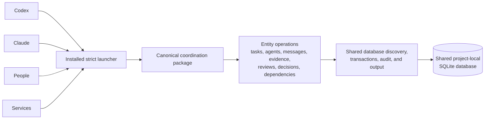

# Coordination Runtime

This directory is the canonical, harness-neutral Python implementation of the
SQLite coordination backend. The installer copies it into a target project so
local agents can share tasks, messages, dependencies, reviews, decisions,
artifacts, evidence, escalations, and health reports through one database.

Harness-specific skills and instruction files may explain how to use this
runtime, but they must not carry a second implementation.

## Runtime Boundary



`cli.py` dispatches commands to modules under `entities/`, while
`core.py` provides database discovery, connections, timestamps, audit logging,
JSON output, validation, advisory locks, and atomic file publication. SQLite
enables foreign keys and write-ahead logging. Short immediate write
transactions, a configurable busy timeout, exclusive session-owned task
claims, and optimistic task revisions let multiple local processes safely use
the same database without silently overwriting each other.

The portable `scripts/coordination.py` launcher imports only the sibling
installed `lib/coordination` package. It must not search unrelated working
directories or ambient Python packages. The installer copies the repository
root `coordination/` package into that location; no harness-specific runtime
copy is permitted.

## Actor Identity

An actor ID should identify the accountable participant, not the program used
to run it. Prefer stable IDs such as `engineering-1`, `security-reviewer`, or
`josh` over IDs such as `codex-engineering` or `claude-reviewer`.

These are separate concerns:

- **Actor identity**: the durable principal that owns work and appears in audit
  history.
- **Actor type**: whether the principal is an AI agent, human, or service.
- **Role**: engineering, product, security review, release authority, and so on.
- **Execution context**: the harness, model, and session currently acting for
  that principal.

The schema stores identity, actor type, and role in `agents`. Execution details
live in `agent_sessions`, and audit records can reference both the stable actor
and the active execution session. This lets one actor move between Codex,
Claude, or another harness without renaming the actor or losing exact runtime
attribution.

## Package Layout

```text
coordination/
  README.md
  core.py
  cli.py
  entities/
    agents.py
    artifacts.py
    decisions.py
    diagnostics.py
    dependencies.py
    escalations.py
    evidence.py
    messages.py
    maintenance.py
    reports.py
    reviews.py
    sessions.py
    tasks.py
  errors.py
```

The first supported schema lives at `sqlite/schema.sql`.
`scripts/coordination.py` is the portable executable entry point used by the
repository and installed projects. Python 3.10 or newer is required. Schema
version 1 is created directly; no migration from a pre-release database is
provided.

## Operational Guarantees

- all initialized connections enforce foreign keys, WAL mode, and `FULL`
  synchronous durability
- write operations use short immediate transactions and return a distinct busy
  result when the configured timeout expires
- database maintenance takes an advisory file lock shared by every installed
  CLI process
- exports, backups, and restore publication use destination-directory
  temporary files and atomic publication
- without `--force`, file-producing commands atomically refuse to clobber an
  output created by another process
- restore validates its input and records the restore intent before publishing
  replacement state
- restore preserves a verified recovery copy of a healthy target and reports
  publication, verification, audit, safety-copy, and rollback outcomes

The complete machine contract is [documented here](../docs/cli-contract.md).
