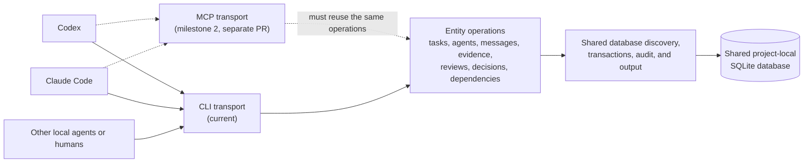

# Coordination Runtime

This directory is the canonical, harness-neutral Python implementation of the
SQLite coordination backend. The installer copies it into a target project so
local agents can share tasks, messages, dependencies, reviews, decisions,
artifacts, evidence, escalations, and health reports through one database.

Harness-specific skills and instruction files may explain how to use this
runtime, but they must not carry a second implementation.

## Current Architecture



Today, `cli.py` dispatches commands to modules under `entities/`, while
`core.py` provides database discovery, connections, timestamps, audit logging,
and JSON output. SQLite enables foreign keys and write-ahead logging. Short
immediate write transactions, a configurable busy timeout, exclusive
session-owned task claims, and optimistic task revisions let multiple local
processes safely use the same database without silently overwriting each
other.

If an MCP transport is added, entity mutations should first be extracted into
transport-independent service functions. The CLI and MCP adapters must call
those same functions and must never implement separate validation or state
transition rules.

## Actor Identity

An actor ID should identify the accountable participant, not the program used
to run it. Prefer stable IDs such as `engineering-1`, `security-reviewer`, or
`josh` over IDs such as `codex-engineering` or `claude-reviewer`.

These are separate concerns:

- **Actor identity**: the durable principal that owns work and appears in audit
  history.
- **Actor type**: whether the principal is an AI agent, human, or service.
- **Role**: engineering, product, security review, release authority, and so on.
- **Execution context**: the harness, model, and session currently acting for
  that principal.

The schema stores identity, actor type, and role in `agents`. Execution details
live in `agent_sessions`, and audit records can reference both the stable actor
and the active execution session. This lets one actor move between Codex,
Claude, or another harness without renaming the actor or losing exact runtime
attribution.

## Package Layout

```text
coordination/
  README.md
  core.py
  cli.py
  entities/
    agents.py
    artifacts.py
    decisions.py
    diagnostics.py
    dependencies.py
    escalations.py
    evidence.py
    messages.py
    maintenance.py
    reports.py
    reviews.py
    sessions.py
    tasks.py
  errors.py
```

The initial schema lives at `sqlite/schema.sql`, and `scripts/coordination.py`
is the portable executable entry point used by the repository and installed
projects.
